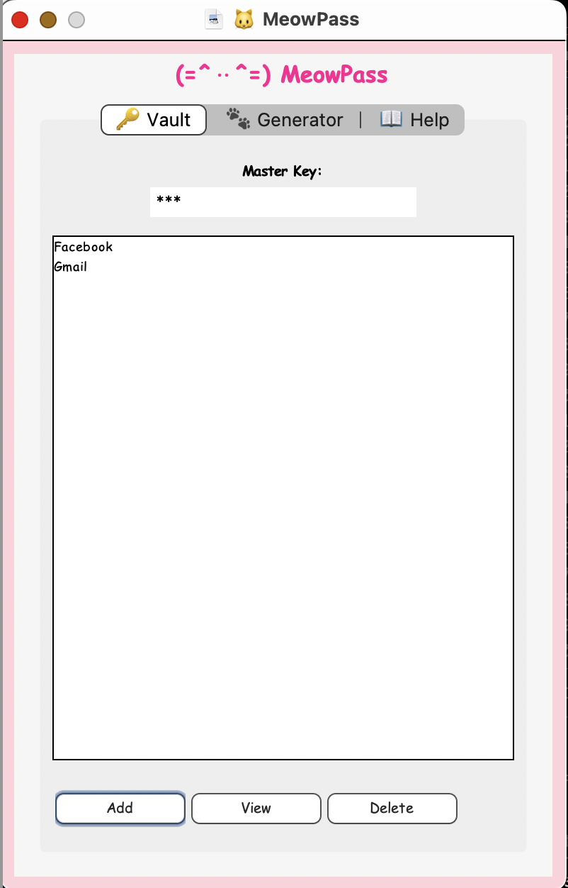

# Password Vault App (Python)

  

## Security Overview  
- Encrypts passwords using Fernet (PBKDF2 + AES)  
- Master key required to decrypt  
- Local-only, no internet access  
- Vault saved to disk securely  

## Features  
- Store, view, and delete passwords  
- Simple themed UI  
- Random password generator with hyphen formatting  
- Help tab with usage instructions  

## Usage Example  
<pre><code>python app.py</code></pre>

## Requirements  
<pre><code>Python 3.x  
cryptography (install with: pip install cryptography)</code></pre>
